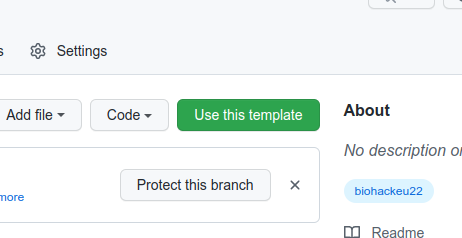

# BioHackJP 23 Report Template

Minimal example of a [BioHackrXiv](https://biohackrxiv.org/) publication that can be generated with the
[Preview Service](http://preview.biohackrxiv.org/).

## Step 1: Clone this Template Repository

This repository is a template repository. This means you can hit the green "Use this template"
button to use it as a template to start a new BioHackrXiv Publication:



## Step 2: Configuring the Markdown

The publication Markdown is found in the `paper/paper.md` file. At the top you can edit the
YAML code with metadata. It is important to get this part correct, because otherwise the PDF
generation will fail. The metadata looks like this:

```yaml
title: 'BioHackJP 2023 Report R1: linked data standardization with LLMs'
title_short: 'BioHackJP 2023 LD-LLM'
tags:
  - Linked Data
  - Large Language Models
authors:
  - name: First Author
    orcid: 0000-0000-0000-0000
    affiliation: 1
  - name: Last Author
    orcid: 0000-0000-0000-0000
    affiliation: 2
affiliations:
  - name: First Affiliation
    index: 1
  - name: Second Affiliation
    index: 2
date: 30 June 2023
cito-bibliography: paper.bib
event: BH23JP
biohackathon_name: "BioHackathon Japan 2023"
biohackathon_url:   "https://2023.biohackathon.org/"
biohackathon_location: "Kagawa, Japan, 2023"
group: R1
# URL to project git repo --- should contain the actual paper.md:
git_url: https://github.com/biohackathon-jp/bh23-report-template
# This is the short authors description that is used at the
# bottom of the generated paper (typically the first two authors):
authors_short: First Author \emph{et al.}
```

### Which metadata to update?

#### To change

The following fields should be changed:

* title
* title_short
* tags
* authors
* affiliations
* date
* group
* authors_short

Particularly important to update is the following field, which should point to
your clone of the template, instead of the template itself:

* git_url: https://github.com/biohackathon-jp/bh23-report-template

## Step 3: Previewing the paper as PDF

This repository can be converted into a preview PDF with BioHackrXiv [Preview Server](http://preview.biohackrxiv.org/).
The preview website asks for the link to your repository and will automatically find the `paper.md` and create an PDF.

# Guide to edit the markdown

## Formatting

The document uses Markdown and you can look at [this tutorial](https://www.markdowntutorial.com/).

## Subsection

Please keep sections to a maximum of only two levels with `##`.

## Tables and figures

Tables can be added in the following way, though alternatives are possible:

| Header 1 | Header 2 |
| -------- | -------- |
| item 1 | item 2 |
| item 3 | item 4 |

Table: Note that table caption is automatically numbered.

A figure is added with:


# Other main section on your manuscript level 1

Lists can be added with:

1. Item 1
2. Item 2

# Citation Typing Ontology annotation

You can use CiTO annotations, as explained in [this BioHackathon Europe 2021 write up](https://raw.githubusercontent.com/biohackrxiv/bhxiv-metadata/main/doc/elixir_biohackathon2021/paper.md) and [this CiTO Pilot](https://www.biomedcentral.com/collections/cito).
Using this template, you can cite an article and indicate why you cite that article, for instance DisGeNET-RDF [@citesAsAuthority:Queralt2016].

Possible CiTO typing annotation include:

* citesAsDataSource: when you point the reader to a source of data which may explain a claim
* usesDataFrom: when you reuse somehow (and elaborate on) the data in the cited entity
* usesMethodIn
* citesAsAuthority
* discusses
* extends
* agreesWith
* disagreesWith
